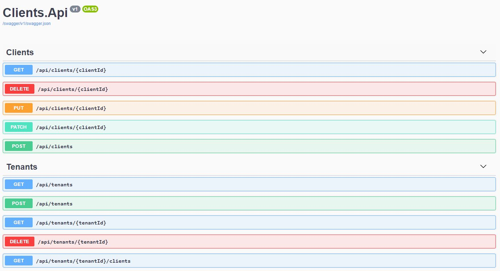

# Contacts Management

#### ASP.NET Core Project using .NET 5

---

* A simple Web API project to create, update & delete tenants and clients.
* Clients must belong to a tenant, so create a tenant first & then create a client.
* Once created, client can also be moved to a different tenant using PATCH endpoint.

This project uses

* .NET Core 5.0
* Entity Framework
* Automapper
* Swagger
* Entity Framework InMemory (For tests)
* FluentAssertions  (For tests)
* xUnit  (For tests)
* WebApplicationFactory (For tests)

Update database name and connection string in `appsettings.json` & then run `dotnet ef database update`.

Api endpoints - <kbd></kbd>

